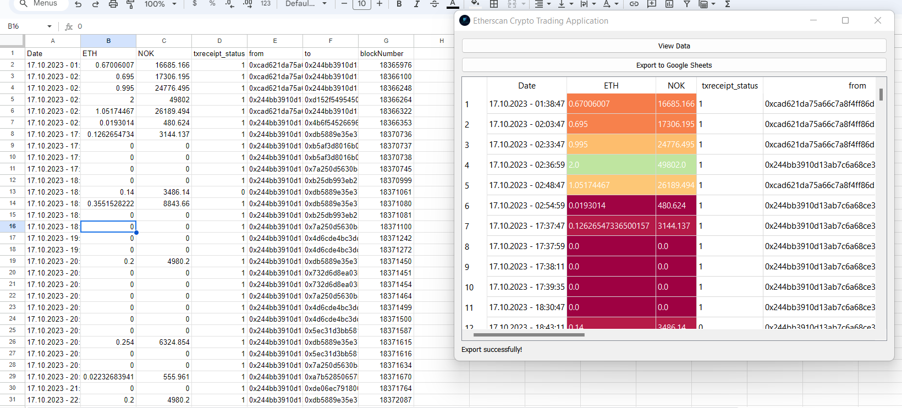

# Automation-of-Ethereum-Crypto-Currency-Trading-Transactions

Automate the Transactions of Specific Wallet from Etherscan Website that trade with Ethereum Crypto Currency to a Pandas Dataframe and adding a comparison to specific Currency with it's Real-time price change by scraping Coingecko API to perform Real time updates.
Using Google Cloud & Sheets API , sending the produced data to Google Sheets by just clicking the Button on the Application.

